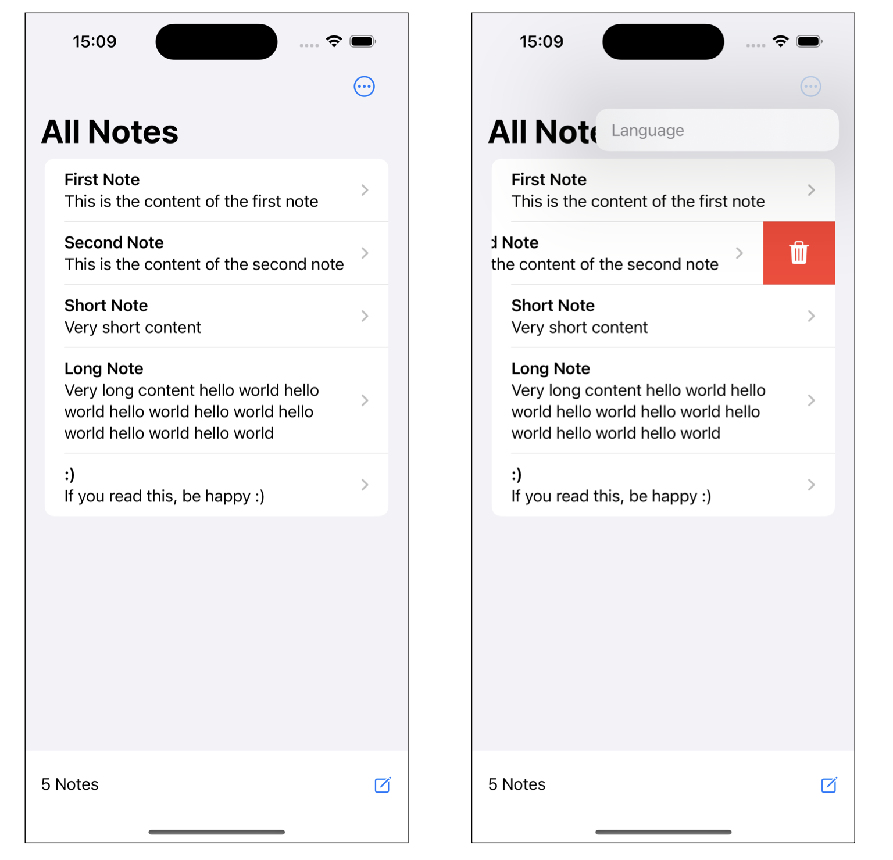
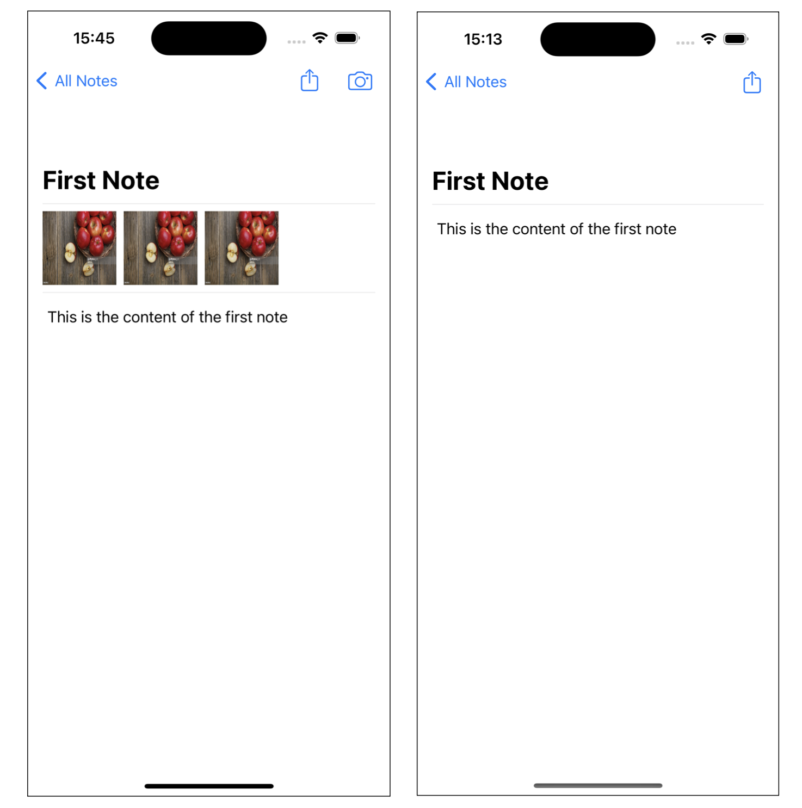

# Notes App
A demo app created specifically for educational purposes at the university, showcasing various features and capabilities.

The Notes app is a simple, user-friendly application built in SwiftUI for creating, editing, and managing your notes. With the ability to add photos to your notes and easily share them, the Notes app provides a convenient way to keep track of your thoughts, ideas, and important information.

## Features
- Create Notes: Quickly jot down your thoughts and ideas.
- Edit Notes: Easily make changes and updates to your existing notes.
- Delete Notes: Remove notes you no longer need.
- Add Photos: Enhance your notes by attaching photos to them.
- Share Notes: Share your notes with others through various sharing options.

## Usage
Once you have the app up and running, here's how to use its features:

### Creating a Note
- Click the "New Note" button in the bottom right cornerto create a new note.
- Enter the title and content of your note.
- Optionally, you can add photos to your note by clicking the camera buttonn.
- Save your note when you're done.

### Editing a Note
- Select the note you want to edit from the list of existing notes.
- Make the desired changes to the title, content, or attached photos.
- Save your changes.

### Deleting a Note
- Swipe right on the note you want to delete and click the red trash button.

### Adding Photos to a Note
- When creating or editing a note, click the camera button.
- Choose a photo from your device's gallery to attach to the note.
- Save your note with the attached photo.

### Sharing a Note
- Select the note you want to share from the list of existing notes.
- Click the "Share" button
